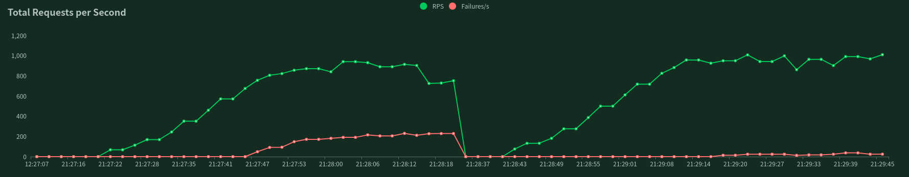

# 概要
- DDD/クリーンアーキテクチャでAPIサーバを実装
- 負荷対策にRedisを利用したキャッシュシステムを実装(下図右側でエラー抑止)
- 負荷テストを導入(locust/GKE等利用)
- DBパフォーマンスの劣化測定(1000万レコード下でのインサート速度測定)

<p align="center"></p>

- 対策前(左):  753RPS, 229Failures/s (エラー率 30%以上)
- 対策後(右): 1011RPS,  25Failures/s (エラー率 2%程度)
- 機器: CPU: Ryzen7(3.1GHz/8core) MEM: 64GB
- シナリオ: 〜3000userによるカレンダー閲覧/予約作成 (詳細は`./docker/loadtest/locustfile.py`)

# APIの想定サービス
シンプルな機能なため話題となったワクチン大規模接種会場の予約システムがテーマ  
1. 管理者が予約枠を作成                例) 1月1日 9時20分台に100人まで受入れ可能な予約枠を作成
2. 希望者は予約枠の残数をカレンダー表示 例) 各月カレンダーと各日タイムテーブルで予約枠残りを確認
3. 希望者が予約枠を確保                例) 1月1日 9時20分台の予約枠に1名分のチケット情報を登録

# CLIとコマンド類について
## Apiサーバ関連コマンド
`./cmd` に各コマンドを実装

```shell
# CLIのインストール
go install 

# CLIをインストールせずに使う場合
go run main.go

# 設定値一覧の出力(config.yml / 環境変数を反映したもの)
go run main.go configs

# DBマイグレーション
go run main.go migrate

# APIサーバの起動
go run main.go start

# APIサーバ用 MySQLとMongoDBの起動 (マイグレーションやAPIサーバ起動時に必要)
cd ./docker/server
docker-compose up
```

## DBテスト用のコマンド類, 
```shell
# bulk insert test data: schedules
go run main.go insert-schedules

# bulk insert test data: reservations (with schedule foreign keys)
go run main.go insert-reservations

# test insertion time: reservation
go run main.go insert-reservation-bench
```

## ロードテスト
以下のシナリオでロードテストできます。
1. ユーザは直近の2ヶ月分の混雑状況を取得(カレンダー形式で予約可能日を一括表示)
2. 各日のタイムテーブルから各時間枠の予約残数を表示 例)10/1 9時20分台は残り20人予約可能)
3. ユーザは利用可能な予約枠を指定して予約作成

```shell
# ローカルで試す場合(worker数はcpuコアの1/2程度)
cd ./docker/loadtest/local
docker-compose up --scale worker=8

# GKEの場合は以下を参考にビルド/デプロイして下さい。
./docker/loadtest/gke/README.md

# 事前にDBマイグレーションと予約枠の定義が必要です
go run main.go migrate
go run main.go insert-schedules
```

## help
```shell
# 全コマンドのヘルプ
go run main.go -h

# 各コマンドのヘルプ
go run main.go insert-reservations -h
```

# TODO
- unitテスト品質の向上
  - go-cmpに変更(reflect.reflect.DeepEqual)
  - テストケースの網羅(軽く書いただけなので境界値等網羅しておらず...)
- E2Eテスト追加
